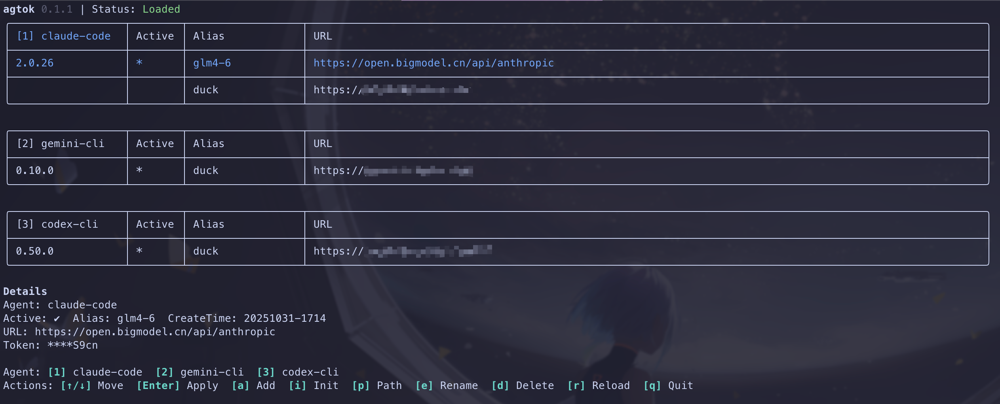

# 1. Introduction

agtok is a tool for centrally managing and switching tokens and base URLs for three common CLIs with a single command: claude-code, gemini-cli, and codex-cli. It supports both interactive TUI and command-line interface (CLI). It manages presets grouped by Agent, supports preview and application, and ensures atomic writes with backups.

# 2. Preview



# 3. Quick Start

## Install agtok

To be added

## Initialize Presets, run in your usual terminal:

```bash
agtok init
```
## Open the Preset Management TUI:

```bash
agtok
```

# 4. Features

- Preset Structure
  - Presets are stored by Agent in separate files under `~/.config/token-switcher/presets/`
  - Example (`claude.json`):
  ```json
  { "version": 1, "presets": [
    { "alias": "dev", "url": "https://...", "token": "sk-...", "added_at": "20251031-0945" }
  ]}
  ```
  - In the TUI, press `p` to display the preset directory path in the top Status bar.

- Initialize Presets
  - TUI: In an Agent table, press `i` to generate a preset from the current disk configuration (default alias `snap-default`, automatically adds a timestamp if name conflicts); automatic deduplication.
  - CLI: `agtok init [--agent <id>] [--alias <name>]`

- Add Presets
  - TUI: Press `a` to open the form (URL is required, Alias can be empty, Token is optional), press Enter to save.
  - CLI: `agtok presets add --agent <id> [--alias <name>] --url <u> [--token <t>]`

- Apply Presets to Agent Configuration
  - TUI: Select a preset and press `Enter`; writes are atomic with backups, permissions 0600; Claude only writes `ANTHROPIC_AUTH_TOKEN`.
  - CLI: `agtok apply --agent <id> --alias <name> [--dry-run]` or `agtok apply --agent <id> --url <u> [--token <t>]`

- Rename/Delete Presets
  - TUI: `e` to rename (validates uniqueness and format), `d` to delete (requires secondary confirmation); the active row cannot be deleted.

- Version Detection
  - TUI: The first column of each Agent's active row displays the version number; `Not installed` is shown if not installed, `Unknown` if parsing fails.
  - Detection commands: `claude -v` / `gemini -v` / `codex -V`; asynchronous backfill, cached for 60s.

- Running Modes
  - TUI: Run `agtok` without parameters to enter TUI; or explicitly `agtok tui`.
  - CLI: Effective when subcommand and parameters are passed (list/apply/presets/init).

# 5. Supported Agents

- Claude-code (agent id: `claude`)
  - Path: `~/.claude/settings.json`
  - Keys: Reads `env.ANTHROPIC_AUTH_TOKEN`/`_API_TOKEN`/`_API_KEY`; only writes `_AUTH_TOKEN`.

- Gemini-cli (agent id: `gemini`)
  - Path: `~/.gemini/.env`
  - Keys: `GOOGLE_GEMINI_BASE_URL`, `GEMINI_API_KEY`.

- Codex-cli (agent id: `codex`)
  - Path: `~/.codex/config.toml` (`model_providers.codex.base_url`), `~/.codex/auth.json` (`OPENAI_API_KEY`).

# 6. Supported Platforms

- macOS, Linux: Fully supported (TUI/CLI, preset persistence, version detection, atomic writes).
- Windows: Planned support.